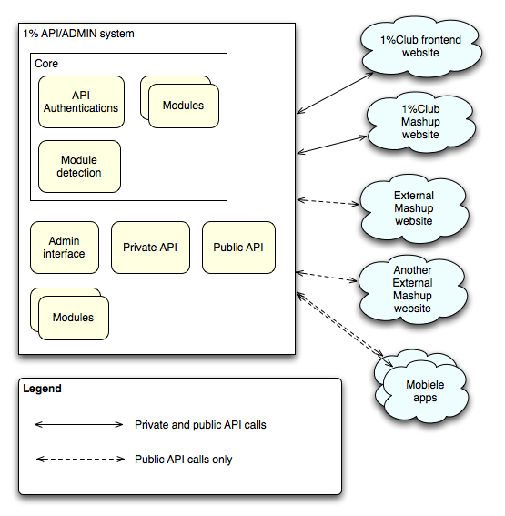
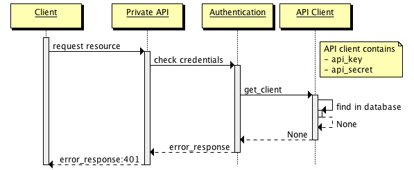
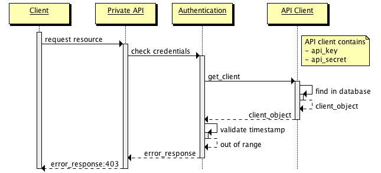
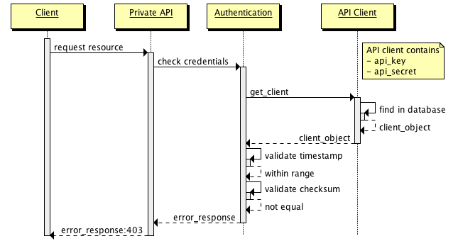
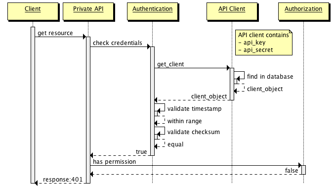
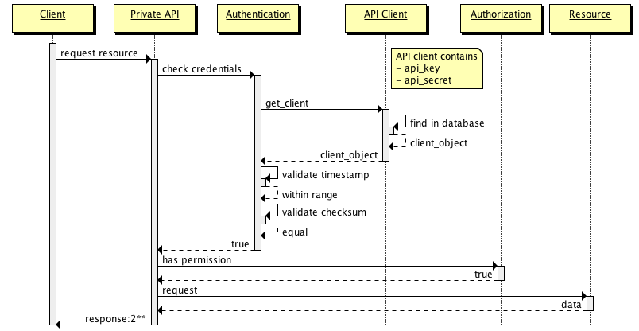

=======================================
Welcome to the 1%Platform Documentation
=======================================

Contents:

.. toctree::
    :maxdepth: 2
    :glob:

--------------------------
Private API Authentication
--------------------------

The private API will use the shared secret authentication method.
Note that this API gives access to private data that should not be available for everyone

To do a request to the private API you need to take the following data:

* API key
* API Secret

Both these are stored on the server and you should have them client side.
The API Secret should never be shared or transmitted over the web, it is used to generate the checksum only.

1. Generate a epoch timestamp in UTC in whole seconds
2. Get all the GET parameters you want to send to the server including the api_key and timestamp but without the checksum
3. Make the keys lowercase and sort them by key
4. Turn the parameters into a urlencoded querystring
5. Use the request method followed by a space, followed by the request path and the querystring (don't forget the ? in between) followed by two newlines and the request content (POST/PUT data when)
6. Use the generated string and the API secret to HMAC-SHA1 encode and get a hexdigest.
7. Do your request to the api in the GET parameters be sure to include the timestamp, api_key and the generated checksum

The server might return a 403 Forbidden, the content will give you some details on the reason of the error.
It could also return 503 Service Unavailable, this usually means you have been doing too many requests and you are being throttled

`See this article <http://www.thebuzzmedia.com/designing-a-secure-rest-api-without-oauth-authentication/>`_
for details and reasoning for this implementation

For the implementation of the Private API `django-tastypie`_ seems to be the one offering the most features for the private API

Below are the sequence diagrams of how the different parts of the API work and what is processed in what order

.. _django-tastypie: http://django-tastypie.readthedocs.org/

-------------------------
Public API Authentication
-------------------------

For the public API authentication we'll use the `OAuth2`_ implementation.

The public API will have both anonymously accessable and authentication required resources.

The anonymously accessable calls will contain generic data the 1%Club wishes to expose to everyone.

The authentication required resources will also expose further data for that specific user who gave the authentication.

That way you could write a simple app that notifies the user when one of their projects becomes full or something more complex that gives them donation information for their own projects.

`OAuth2`_ is still in draft state, which means it's not finished yet, however `Facebook`_ is using it in their production environment and it allows for giving *scoped* access to the requestor (only allow to see my projects or only profile data or allow posting of comments through the API.)

Which OAuth2 draft spec we'll implement is still not decided as it's dependent on how specialized the API is gonna be.

.. _OAuth2: http://oauth.net/2/
.. _Facebook: http://developers.facebook.com/docs/authentication/

-------
Modules
-------

The setup for 1%Club is very modular, to achieve this many to many relations will always have a through model, this way that application knows about both sides and the sides don't really know about what's in the middle.

So for instance you have projects and profiles, they are related through memberships, but profiles and projects don't really know about it.
Because of this system there are dependencies between modules (project_memberships needs both projects and profiles to be in the system).

The private API will be very basic per model resources to prevent complications and allow implementation of this part of the API to be done in the modules.

For the public API we'll be exposing a lot of specialized data, this part of the API won't be part of the core or the modules (except for authentication and authorization) this will need to be implemented per usecase in the project using the system.
We could provide an example project with the core on how to do this.

Indices and tables
==================

* :ref:`genindex`
* :ref:`modindex`
* :ref:`search`

